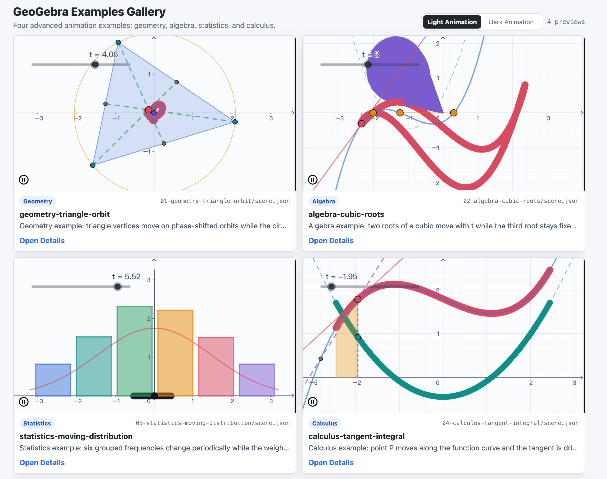

# GeoGebra Animation Skill 中文说明

这是一个标准 `SKILL.md` 格式的 agent 技能，任何支持该格式的 agent 都可以使用：用自然语言描述数学构造，在浏览器中用官方 GeoGebra 引擎预览，然后导出带动画状态的 `.ggb` 文件，以及可粘贴到 GeoGebra 的命令脚本。

## 示例画廊



内置画廊展示了四类动画示例：几何、代数、统计和微积分。每个预览都由对应的 `scene.json` 生成，可以打开详情页、复制 GeoGebra 命令，也可以导出为 Classic 6 `.ggb` 文件。

## 为什么可靠

预览和导出使用同一个官方 GeoGebra 引擎（`deployggb.js`）。预览页通过 `getBase64()` 取得的字节就是最终 `.ggb` 文件，因此浏览器预览和导出的构造共用同一个事实来源。

```text
scene.json -> 真实 GeoGebra 浏览器预览
           -> .ggb 下载
           -> script.txt 命令脚本
```

## 快速开始

```bash
# 1. 可选：使用符号链接安装到本机已配置的 skill 目录。
bash scripts/install-skill.sh

# 2. 检查本地环境。
bash scripts/self-check.sh

# 3. 预览内置几何示例。
node bin/ggb-anim.mjs preview examples/01-geometry-triangle-orbit

# 4. 构建所有本地示例和 2x2 示例画廊。
node bin/ggb-anim.mjs examples

# 5. 导出 GeoGebra 命令脚本。
node bin/ggb-anim.mjs script examples/01-geometry-triangle-orbit

# 6. 为 GeoGebra Classic 6 导出 .ggb 文件。
node bin/ggb-anim.mjs export examples/04-calculus-tangent-integral --style dark
```

示例画廊包含四个高级示例：几何、代数、统计和微积分。它还内置两套动画主题：`light` 和 `dark`。默认使用 `light`；在画廊页面可用 `Light Animation` / `Dark Animation` 按钮切换，也可以在 `preview`、`export`、`script`、`check` 等 CLI 命令中传 `--style dark` 切换到暗色主题。样式选择会应用到 iframe 预览、详情页、复制出来的命令，以及下载的 `.ggb` 文件。

## 命令

| 命令 | 用途 | 依赖 |
| --- | --- | --- |
| `preview <scene>` | 将场景内联到 `preview.html` 并在浏览器中打开 | 浏览器 + 网络访问 |
| `examples [dir]` | 构建每个示例预览和 2x2 画廊 | 浏览器 + 网络访问 |
| `new <name>` | 生成一个 `scene.json` 脚手架 | 无 |
| `script <scene>` | 导出 GeoGebra 命令脚本 | 无 |
| `validate <scene>` | 校验 schema、引用关系和基础语法 | 无 |
| `check <scene>` | 使用真实 GeoGebra 引擎进行无头冒烟测试 | Playwright |
| `export <scene>` | 无头导出 `.ggb` 文件 | Playwright |

`<scene>` 可以是 `scene.json` 文件，也可以是包含该文件的目录。若要启用可选的无头检查和导出能力，请运行：

```bash
bash scripts/install-skill.sh --browser
```

## 支持目标

此技能只验证并导出面向 GeoGebra Classic 6 的 `.ggb` 文件。官方 GeoGebra 安装手册将 Classic 6 列为适用于平板、笔记本和桌面的离线应用，并说明它包含 Graphing、CAS、Geometry、3D Graphing、Spreadsheet、Probability Calculator 和 Exam mode：

https://geogebra.github.io/docs/reference/en/GeoGebra_Installation/

预览页只有一个 `Classic 6 .ggb` 下载按钮。CLI 导出也只写出一个 `.ggb` 文件：

```bash
node bin/ggb-anim.mjs export <scene> --style dark
```

`--format classic` 和 `--format classic6` 仅作为兼容别名被接受。其他 GeoGebra 应用不是已验证目标。

内置主题：

```bash
# 默认 Light 主题。
node bin/ggb-anim.mjs preview <scene>

# 切换到 Dark 主题。
node bin/ggb-anim.mjs preview <scene> --style dark
node bin/ggb-anim.mjs export <scene> --style dark
```

## 仓库结构

```text
SKILL.md            # 技能工作流和硬性规则
AGENTS.md           # 编码代理约束
bin/ggb-anim.mjs    # CLI：preview、examples、new、script、validate、check、export
assets/preview.html # 预览和导出承载页
docs/images/        # README 截图
references/         # 命令、动画配方、schema、API、排障说明
scripts/            # install-skill.sh 和 self-check.sh
examples/           # 四个高级示例
```

## 环境

- 核心功能需要 Node 和现代浏览器。GeoGebra 引擎从官方 CDN 加载。
- 可选的无头 `check` / `export` 需要 Playwright 和 Chromium。
- 已验证的桌面目标：GeoGebra Classic 6。

## 边界

- 可保留动画的导出格式是用 GeoGebra 打开的 `.ggb` 文件。本技能不内置 GIF/MP4 导出。
- 导出兼容性只验证 GeoGebra Classic 6。
- GeoGebra 原生动画是匀速或往返动画，不支持缓动。
- `.ggb` 会保存动画状态，但 GeoGebra 桌面版重新打开后可能需要按下 Play。

## 编写场景的关键规则

- 命令名必须使用英文，例如 `Circle`，不要使用本地化命令名。
- 乘法必须显式写 `*`，例如 `2*cos(t)`、`a*x`、`x*y`。
- 三角函数使用弧度；需要角度时使用 `30°` 或 `30*pi/180`。
- 被引用的对象必须显式命名，例如 `P = (...)`，不要依赖自动标签。
- 样式命令应与对象创建命令分开，例如 `SetColor(P, "#1E88E5")`。
- 通常使用一个时钟滑块，其他对象写成该滑块的函数，并在 `Slider(...)` 的第八个参数中把 `animating` 设为 `true`。

## 参考文档

- 命令：`references/commands.md`
- 动画配方：`references/animation.md`
- 场景 schema：`references/scene-schema.md`
- API 说明：`references/api.md`
- 排障：`references/troubleshooting.md`
